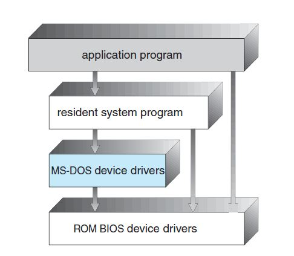
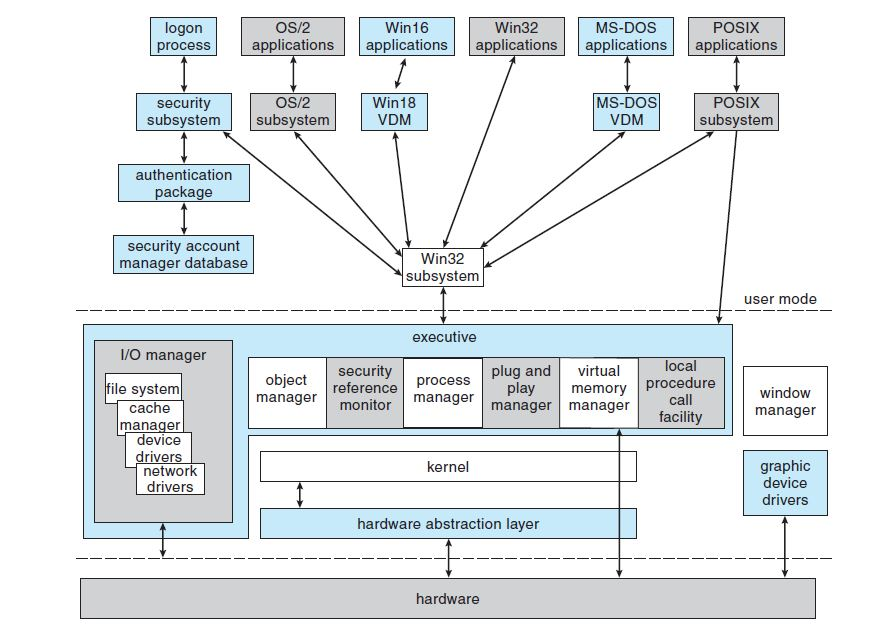
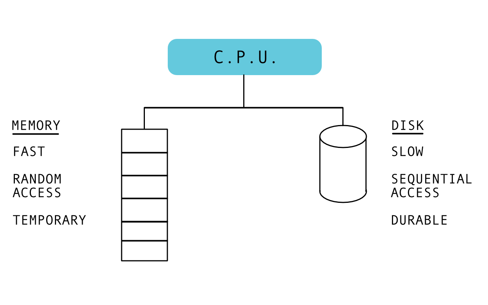
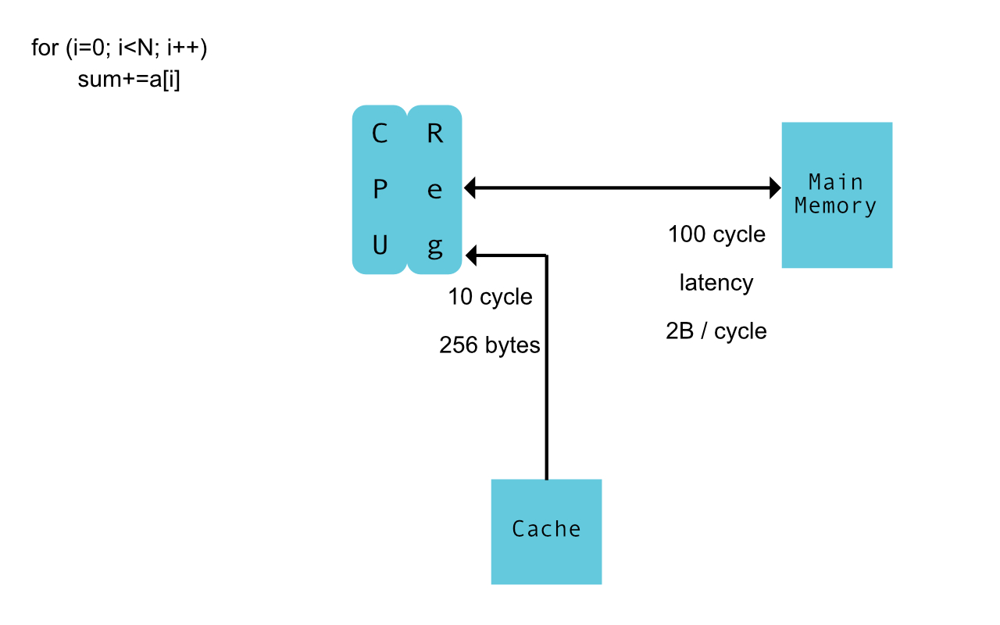
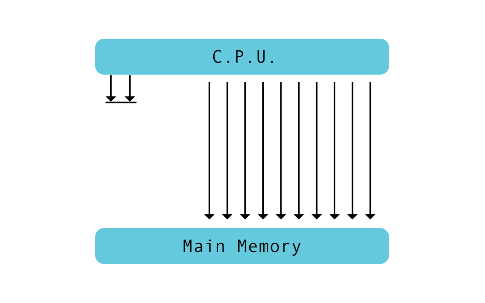
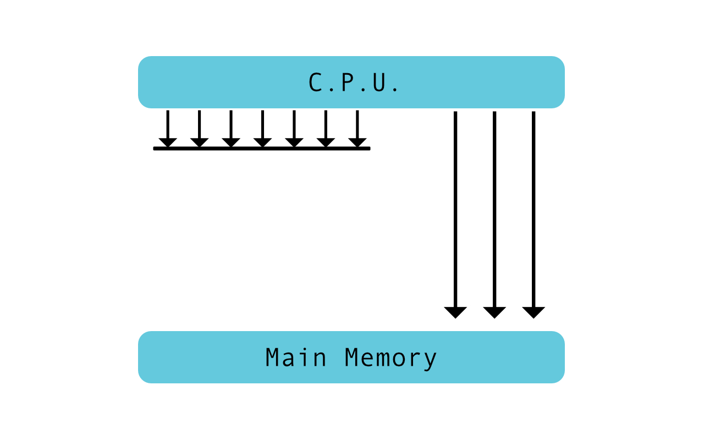
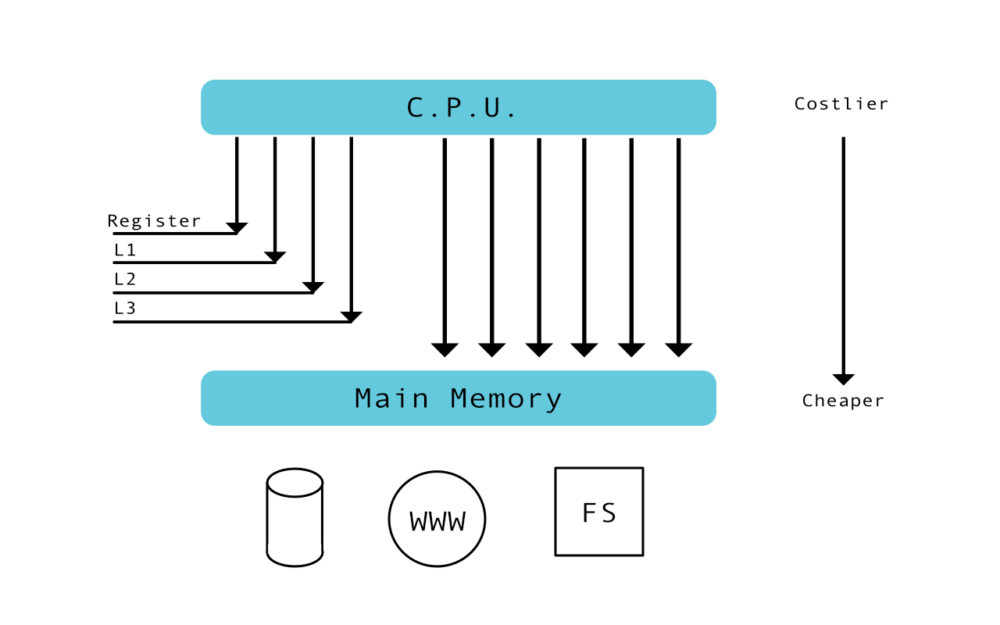
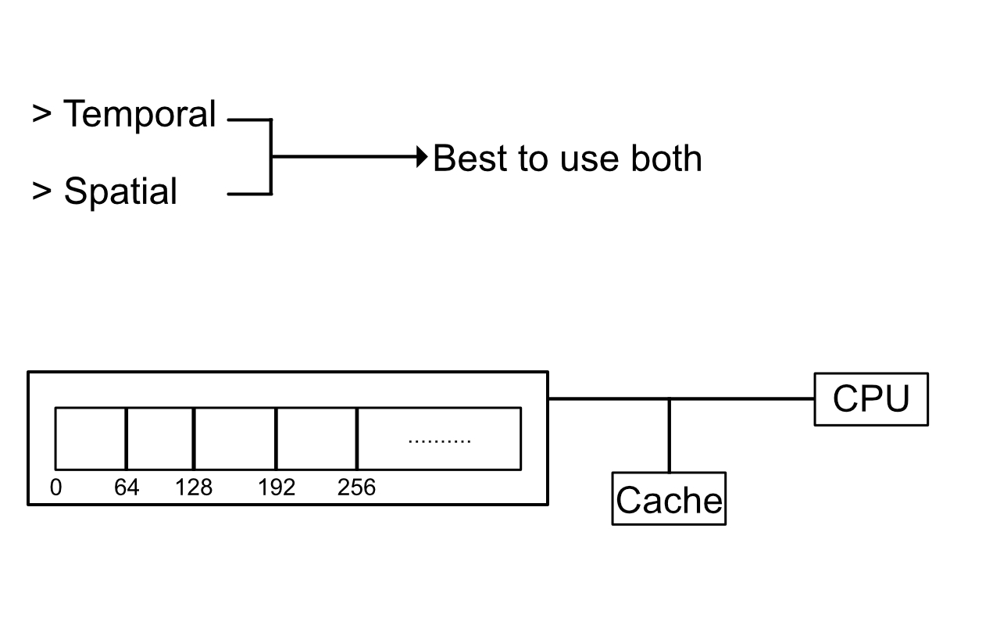
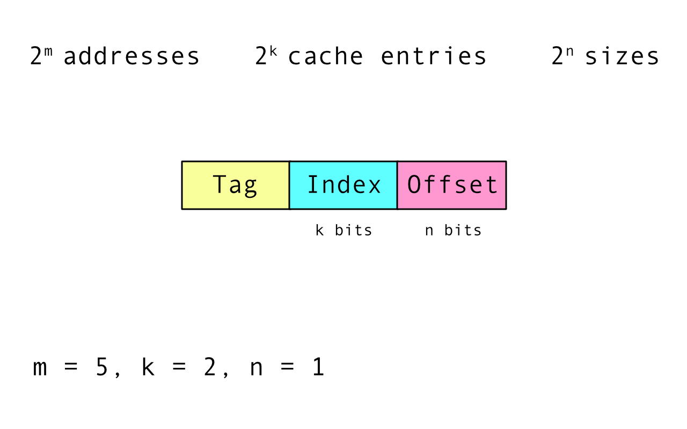

# Linux From Scratch - 1

---

# Speakers

----

# Aditya Kamat

* CSE @ BMSCE
* [Linkedin](https://www.linkedin.com/in/aditya-kamat-53646310b/)
* [Github](https://github.com/GiVeMeRoOt)
* Twitter (@kamat_adi)

----

# Kaushik Iyer

* ISE @ BMSCE
* [Linkedin](https://www.linkedin.com/in/kaushik-iyer-8b75a5a3)
* [Github](https://githib.com/KaushikIyer16)

---

## Table of contents:
* Linux architecture
* Basic User management
* Linux memory structure
* Linux file structure (LFS)
* Linux processes
* Some important tools
* Bash
* Disk management (Partitioning & formatting)

---

# Linux architecture

----

Note: Src- https://www.tutorialspoint.com/operating_system/os_linux.htm

----

Let us look at MS DOS structure:-

Note: Src- Peter Galvin 9th edition

----

Now the one most of you have been using/used.   
Any guesses?

----

Note: Src- Peter Galvin 9th edition

---

# Basic User management
Note: Src- https://www.tecmint.com/manage-users-and-groups-in-linux/

----

Linux is a multi user OS, thus it is a necessity to learn to manage users.  
Let us look at some of the important features provided by linux for the same.

----

# 1. Adding a new user

----

To add a new user, one of these two commands can be used by the **' root '** user:  

> ` # useradd [new_account] `  
> ` # adduser [new_account] `

----

#### These are the four operations performed when a new user is created:
* The user's home directory is created (/home/username by default)
* The following hidden files are copied into the user’s home directory, and will be used to provide environment variables for his/her user session.
> .bash_logout  
> .bash_profile  
> .bashrc  

----

Cont..  
* A mail spool is created for the user at /var/spool/mail/username.  
* A group is created and given the same name as the new user account.
* A record for the user is created in */etc/passwd* ,*/etc/shadow* and */etc/groups*

----

# 2. Editing the credentials of an existing user

----

We can use the following command:  
> ` # usermod [options] [username] `

----

### Time to explore the *usermod* command

----

Setting the expiry date for an account:
> ` # usermod --expiredate 2014-10-30 [username] `

----

Adding the user to supplementary groups:
> ` # usermod --append --groups root,users [username] `

----

Changing the default location of the user’s home directory:
> ` # usermod --home /tmp [username] `

----

Changing the shell the user will use by default:
> ` # usermod --shell /bin/sh [username] `

----

Displaying the groups an user is a member of:
> 1. ` # groups [username] `  
> 2. ` # id [username] `

----

Let us execute all the above commands in one go:
> `# usermod --expiredate 2018-10-30 --append --groups root,users --home /tmp --shell /bin/sh [username]`

----

# 3. Suspending an user's account

----

Suspend:
> ` # usermod --lock [username] `   

Unsuspend:
> ` # usermod --unlock [username] `

----

# 4. Deleting an user's account

----

Delete an user's account using the following command:
> `# userdel --remove [username]`

---

# Linux memory structure

----

# NAIVE MEMORY MODEL

----

----

# CACHE MOTIVATION

* Cache Hit
* Cache Miss

----

----

# MEMORY HIERARCHY

* Speed v Capacity, which are you gonna choose

----

----

----

why do you have to?

----

----

Locality and cache blocks

----

----

What is Mapping?

* Given a cache block, how do you know if a memory address is present in the cache or not

----

Direct Mapping

----

----

## Write Policy

* Cache Hit:
  * Write through
  * Write Back

* Cache Miss:
  * Write allocate
  * No-write allocate

----

# VIRTUAL ADDRESSES

Abstraction for a process is key.

----

Address Translation

* This is a Layer of indirection.

* Key Components are:
  * Page Table( Separating and Sharing data)
  * Global Page Table

----

# PAGING

----

# PAGE FAULT

---

# LINUX FILE STRUCTURE
Note: Src-http://www.thegeekstuff.com/2010/09/linux-file-system-structure/?utm_source=tuicool

----

> `bin, sbin, etc, dev, proc, var, tmp, usr, home, boot, lib, opt, mnt, media, srv`
Note: ctrl -- to see the entire image
Note: src-https://www.thegeekstuff.com/2010/09/linux-file-system-structure/

----

## / - Root:
* Every single file and directory starts from the root directory.
* Only root user has write privilege under this directory.
* Please note that /root is root user’s home directory, which is not same as /.

----

## /bin - User binaries:
* Common linux commands you need to use in single-user modes are located under this directory.
* Commands used by all the users of the system are located here.
* For example: ps, ls, ping, grep, cp.

----

## /sbin - System binaries:
* The binaries for linux commands located under this directory are used typically by system aministrator, for system maintenance purpose.
* For example: iptables, reboot, fdisk, ifconfig.

----

## /etc - Configuration files:
* Contains configuration files required by all programs.
* This also contains startup and shutdown shell scripts used to start/stop individual programs.
* For example: /etc/resolv.conf, /etc/logrotate.conf

----

## /dev – Device files:
* These include terminal devices, usb, or any device attached to the system.
* For example: /dev/tty1, /dev/usbmon0

----

## /proc – Process information:
* Contains information about system process.
* This is a pseudo filesystem which contains information about the running processes. For example: /proc/{pid} directory contains information about the process with that particular pid.
* This is a virtual filesystem with text information about system resources. For example: /proc/uptime.

----

## /var – Variable files:
* Content of the files that are expected to grow can be found under this directory.
* This includes — system log files (/var/log); packages and database files (/var/lib); emails (/var/mail); print queues (/var/spool); lock files (/var/lock); temp files needed across reboots (/var/tmp);

----

## /tmp – Temporary files:
* It is a directory that contains temporary files created by system and users.
* Files under this directory are deleted when system is rebooted.

----

## /usr – User programs:
* Contains binaries, libraries, documentation, and source-code for second level programs.
* /usr/bin contains binary files for user programs. If you can’t find a user binary under /bin, look under /usr/bin.
* /usr/sbin contains binary files for system administrators. If you can’t find a system binary under /sbin, look under /usr/sbin.
* /usr/lib contains libraries for /usr/bin and /usr/sbin
* /usr/local contains users programs that you install from source.

----

## /home – Home directories:
* Home directories for all users to store their personal files.
* For example: /home/adi, /home/iyer

----

## /boot – Boot loader files:
* Contains files that will be used during the system boot.
* Kernel initrd, vmlinux, grub files are located under /boot.

----

## /lib – System libraries:
* Contains library files that supports the binaries located under /bin and /sbin.
* Library filenames are either ld* or lib*.so.*
* For example: ld-2.11.1.so, libncurses.so.5.7

----

## /opt – Optional add-on applications:
* Contains add-on applications from individual vendors.
* Add-on applications should be installed under either /opt/ or /opt/ sub-directory.

----

## /mnt – Mount directory:
* Temporary mount directory where sysadmins can mount filesystems.

----

## /media – Removable media devices:
* Temporary mount directory for removable devices.
* For examples, /media/cdrom for CD-ROM; /media/floppy for floppy drives; /media/cdrecorder for CD writer

----

## /srv – Service data:
* Contains server specific services related data.
* For example, /srv/cvs contains CVS related data.

---

# LINUX PROCESSES

----

#### Process Control Block

* fork()
* exec()

----

#### **`ps`** : process listing

> ps -ax

----

#### synchronization

----

**`Baton Pass Problem`**
Check out ForkExample.c program for the solution

----

#### Threads

----

Multi-Threading Models
* Many to One
* One to One
* Many to Many

----

#### SIGNALS

---

# IMPORTANT TOOLS

----

### User account related tools :

----

#### 1. **`su`** : Switch User
* Example: su `<username>`
* Enter the user's password when prompted.

----

#### 2. **`whoami`** : Current user's username
* This command is used to find out the username of the current user.
* Tip: `$` signifies normal user and `#` signifies root user at the prompt.

----

#### 3. **`passwd`** : Change the password of an user's account.
* Example: passwd adi
* Only root can change the password of all the users and the normal users can only change their own passwords.

----

#### 4. **`id`** : Used to check id's of the user
* It displays different id's such as user id, group id etc.
* Root user has id = 0.

----

### File system related commands :

----

* ls
* cd
* pwd
* locate
* mount
* mkdir
* rm
* cp

----

Continued ...  
* find
* cat
* less
* head
* tail
* |

----

### System related commands :

----

#### 1. **`$path`**
* This is used to set a global path for the applications so that they can be used from anywhere.
* Multiple paths can be appended separated by `';'`.

----

#### 2. Run a program using `'./<program_name>'`
* The first line of your program should contain the path of the compiler/interpreter.

----

#### 3. **`ps`** : Displays a list of running processes
* This is generally used to find out the id of a particular process.
* It also displays the TTY value and the time since the process is executing.

----

#### 4. **`grep`** : Print lines matching a pattern
* It is used to search for a particular pattern in the provided input.
* Syntax: `grep [OPTIONS] PATTERN [FILE...]`  
* Example: `grep 'adi' name.txt`

----

#### 5. **`gcc`** : GNU project C and C++ compiler
* Gcc does the following normally: preprocessing, compilation, assembly and linking.
* It also provides a set of options to alter the normal procedure it follows. This will not be covered in this section.
* Example: gcc -o adi adi.c

----

#### 6. **`uname`**
* It is used to print system related information.
* Synatx: `uname [options]`
* Example: `'uname -a'` can be used to print all the information.
* Example: `'uname -r'` is used to print the kernel release information.

----

### Network related commands :

----

#### 1. **`ping`** : Sends ICMP echo request to nodes
* This tool is used to check if a node is alive in any network.
* Example: ping -c 10 google.com
* Tip: TTL is a value which is the maximum number of hops a packet encounters before reaching the destination.

----

#### 2. **`traceroute`**
* It is used to find the nodes that have been traversed by our packets to reach the destination.
* Example: `traceroute google.com`

----

#### 3. **`dig`** : DNS lookup utility
* It performs DNS lookups and displays the answers from the name servers.
* It is usually used to troubleshoot DNS resolution problems.
* Syntax: `dig @server rr_name record_type`

----

#### 4. **`ifconfig`**
* Used to configure a network interface.
* If no arguments are given, ifconfig displays the status of the currently active interfaces.
* Example: `'ifconfig eth0 netmask 255.255.255.224'` assigns the subnet mask to the interface 'eth0'.

----

#### 5. **`netstat`**
* It is used to print network connections, routing tables, interface statistics, masquerade connections, and multicast memberships.
* Check more about netstat [here](https://linux.die.net/man/8/netstat).

---

# BASH SCRIPTING

----

The shebang:
> `#!/bin/bash`

----

Any set of tokens to the left of an expression is considered a variable

----

variables are declared as ***variable_name=value*** with no space in between them.
> `var1=kaushik`

spaces are considered separators in bash and is hence to be followed by a pair of single quotes when using multi-word values for variables
> `var2='ki iyer'`

----

echo is the equivalent of printf

> `echo "string to be printed"`

----

variables are printed by placing a ***$*** sign before it
> `echo $var1 `

----

double quotes allow you to substitute a variable in the string.

>`var3="$var1 a.k.a knsi"` 
> `echo $var3`

----

input is taken by using the read command

>`echo "hello who am i talking to?"` 
>`read name` 
>`echo $name`

----

command line arguments are taken as numbers with `$`0 as the name of the file
> `echo $0`
> `$1` 
> `# bash ./test.sh abc` 

---

# DISK MANAGEMENT

----

This section will focus on formatting and partitioning disks (using fdisk) and mounting disks (using mount).

----

# <u>**fdisk**<u>
Note: src-https://www.howtogeek.com/106873/how-to-use-fdisk-to-manage-partitions-on-linux/

----

List partitions:
> sudo fdisk -l

----

Entering command mode:
> sudo fdisk /dev/sda

Enter `'m'` to list all commands.

----

* View partition table: `'p'` .
* Delete a partition: `'d'` .
* Create a new partition: `'n'` .
* Tip: An OS can only be installed on a primary partition and a disk can have a maximum of four primary partitions.
* Change the partition type: `'t'` .
* Write changes to disk: `'w'` .

----

#### Formatting a partition:
> sudo mkfs.ext4 /dev/sda5

----

# <u>**mount**<u>

----

Syntax:
> `'mount -t type device dir'`

This tells the kernel to attach the file system found on device (which is of type type) at the directory dir. The previous contents (if any) and owner and mode of dir become invisible.

----

Type `'mount'` to get a list of devices that are mounted.

 `[Or]` 

cat the contents of `'/etc/mtab'`

----

Example:
> `'mount -t etx4 /dev/sdc1 /media/pendrive/'`

----

To unmount a device, use:
> `'umount /dev/sdc1'`

 `[Or]` 

> `'umount /media/pendrive/'`

---

# Thank you
