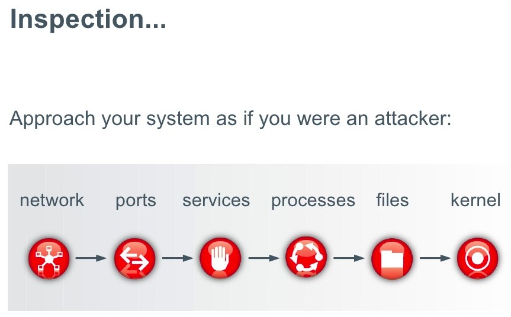
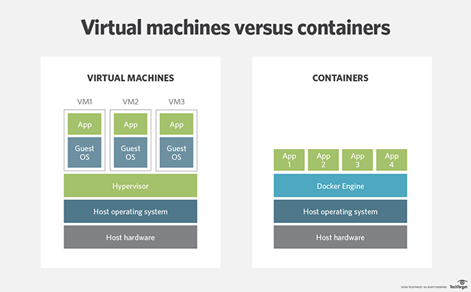
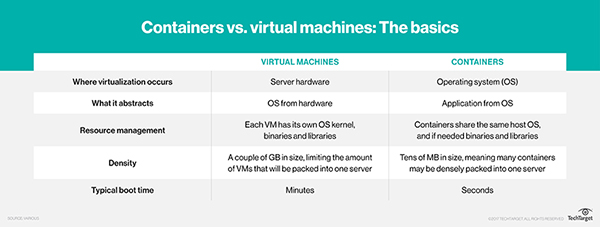

# Linux From Scratch - 5

---

# Speakers

----

# Aditya Kamat

* CSE @ BMSCE
* [Linkedin](https://www.linkedin.com/in/aditya-kamat-53646310b/)
* [Github](https://github.com/GiVeMeRoOt)
* Twitter (@kamat_adi)

----

# Kaushik Iyer

* ISE @ BMSCE
* Update anything more you want to put here

---

# Linux OS hardening
Note: Src- https://www.slideshare.net/SunilPaudel1/linux-server-hardening-steps-by-steps

---

### Table of contents:
* Keeping the system updated
* Securing ports
* Firewalls
* BIOS password
* Demo of apache server hardening
* User and group hardening

----

Cont...
* Securing globally writable folders
* Encrypt the File system
* Logging
* IDS/IPS
* Linux namespaces
* SELinux

---

Note: Src-https://www.slideshare.net/NOVL/securing-your-linux-system

---

## Keeping the system updated

----

Use this to update all the packages that have been downloaded from the repositories present in '/etc/apt/sources.list'.   
> ___sudo apt update___

----

This job has to be performed regularly to keep all the packages updated.

----

Two ways to avoid updating packages manually every time:
1. Set a cron job to automatically update, once every week.
2. Use unattended-upgrades package to handle the updation.

----

### Crons:
It is a time based job scheduler for Unix-like OS.
Use 'crontab' command to add crons.

----

Syntax:
> minute hour day month weekday command

Example:
> 0 0 \* \* 1 /mydir/myprogram

In the above example, the program would run only on Mondays.
Note: Refer to more examples here- http://kvz.io/blog/2007/07/29/schedule-tasks-on-linux-using-crontab/

----

### Unattended-upgrades:
This is a tool which allows us to upgrade certain categories of packages automatically

----

Config for it is present in ___'/etc/apt/apt.conf.d/50unattended-upgrades'___  
Remove the '//' for the groups of packages that you desire to automatically update.

----

Set the auto update time interval in this file ___'/etc/apt/apt.conf.d/10periodic'___

----

Disclaimer: If you have live applications running on production servers, don't forget to <b>___exclude___</b> the packages used by the application for auto updates.

---

## Securing ports

----

Find out the IP of the target machine to be secured.
Start a nmap port scan on the host and find out the open ports.
You can also use 'netstat -tulpn' to figure out the open ports on the machine.
  
[Click here for nmap cheatsheet](https://hackertarget.com/nmap-cheatsheet-a-quick-reference-guide/)

----

The number of open ports increases the attack surface area and can lead to a hacker taking advantage of it.
Instead of stopping the services, we can have firewall rules to allow hosts to access only certain ports.

---

## Firewalls

----

'___iptables___' is the firewall present in most of the linux distributions by default.
Let's explore it and write some rules.
Note: Src-https://www.youtube.com/watch?v=eC8scXX1_1M
----

We have three types of chains in iptables:
* INPUT
* FORWARD
* OUTPUT

----

To list all the rules:
> iptables -L

----

Change the default policy of FORWARD to DROP
> iptables -P FORWARD DROP

----

Drop every packet from a particular source
> iptables -A INPUT -s 192.168.0.23 -j DROP

----

Drop every tcp packet on port 25 from any device on the network
> iptables -A INPUT -s 192.168.0.0/24 -p tcp --destination-port 25 -j DROP

----

Allow packets from a particular device
> iptables -A INPUT -s 192.168.0.66 -j ACCEPT

----

Whenever a firewall is running, it goes through the rules from top to the bottom.

----

Deleting the third rule in INPUT
> iptables -D INPUT 3

----

Adding a rule at the top of a chain
> iptables -I INPUT -s 192.168.0.66 -j ACCEPT

----

Check out firewall.sh to see an example implementation of the firewall rules in a bash script.

---

## BIOS password

----

Set a BIOS password to prevent attackers with physical access to your system from making any changes to your BIOS.

----

This will also prevent the attackers from booting from an USB into another linux and access your system.
 
Also, check out ___konboot___ for windows ;)

----

To set/change the BIOS password:
* Enter BIOS settings.
* Navigate to the security tab.
* Select 'Set superuser password' and enter the desired password.

----

Setting the GRUB password:
* Use '___grub-md5-crypt___' to generate a MD5 of the password.
* Edit '/boot/grub/grub.conf' to add Password --md5 &lt;password generated in step 1&gt;
* Change permission of the file with 'chmod 600 /boot/grub/grub.conf' so that only the root user can modify it.

In the grub menu, enter 'p' to type in the password.

---

## Demo of apache server hardening

----

Basic config of the apache server:
* Document root Directory:/var/www
* New website Directory: /var/www/NewWebsite
* Main Configuration file: /etc/apache/apache2.conf
* Default HTTP Port: 80 TCP
* Default HTTPS Port: 443 TCP

----

Cont...
* Test your Configuration file settings and syntax: apache2 –t
* Check apache version: apache2 -v
* Access Log files of Web Server: /var/log/apache2/access_log
* Error Log files of Web Server: /var/log/apache2/error_log

----

Check if the apache server is running by visiting the IP from your browser.

----

### 1. Hide apache version and OS identity
Visiting some random link in the website should not display any important information.

----

Add the following in ___/etc/apache2/apache2.conf___:
* ServerSignature Off
* ServerTokens Prod
 
Restart apache with 'service apache2 restart'

----

### 2. Allow only the directory of the website to be accessible and disable directory listing

----

Add the following in '/etc/apache2/sites-enabled/000-default.conf'
> &lt;Directory "/var/www/newWebsite"&gt;  
>     Options -Indexes -FollowSymLinks  
>     AllowOverride None  
> &lt;/Directory&gt;

----

### 3. Keep apache updated to the latest version

----

Command:
> sudo apt install apache2

----

### 4. Disable unnecessary modules

----

Commands:
> sudo apache2ctl -M  
> sudo a2dismod &lt;module_name&gt;  
> sudo apache2ctl restart

----

### 5. Run apache as a separate user and groups

----

The default apache user and group is www-data
Let us change it to http-web

----

Commands:
> sudo groupadd http-web  
> sudo useradd -d /var/www/ -g http-web -s /bin/nologin http-web  
> sudo nano /etc/apache2/envvars

Edit the following:
* APACHE_RUN_USER=http-web
* APACHE_RUN_GROUP=http-web

----

### 6. Limit the size of the HTTP request

----

By default, apache has no limit on the size of the HTTP request. This can make it easy for an attacker to carry out Denial Of Service attacks.

----

Let us apply a limit of 500KB.  
Edit '/etc/apache2/sites-enabled/000-default.conf'  
Add this line  
> LimitRequestBody 512000

----

### 7. Turn off server side includes and CGI execution

----

This will prevent the client from injecting scripts into the browser.
Edit '/etc/apache2/sites-enables/000-default.conf'  
Add this line:  
> Options -Indexes -FollowSymLinks -Includes ExecCGI

----

### 8. Protect against DDOS attack

----

Modify the following configurations in '/etc/apache2/apache2.conf' :
* TimeOut=60
* KeepAlive=Off
* MaxClients=20
* KeepAliveTimeout=5
* ErrorResponses=Off

----

### 9. Enable apache logging

----

This is important for the forensics part if an attack occurs. 
Modify '/etc/apache2/apache2.conf' and add:  
> LogLevel=debug

The logs will be present in '/var/log/apache2/'

----

Possible log levels and what they mean:
* emerg: Emergency situations where the system is in an unusable state.
* alert: Severe situation where action is needed promptly.
* crit: Important problems that need to be addressed.
* error: An error has occurred. Something was unsuccessful.

----

Cont...
* warn: Something out of the ordinary happened, but not a cause for concern.
* notice: Something normal, but worth noting has happened.
* info: An informational message that might be nice to know.
* debug: Debugging information that can be useful to pinpoint where a problem is occurring.

----

### 10. Disable Trace HTTP request

----

The TRACE method is used to echo the contents of an HTTP Request back to the requester which can be used for debugging purpose at the time of development.
An attacker can take advantage and steal credentials as mentioned [here](http://www.cgisecurity.com/whitehat-mirror/WH-WhitePaper_XST_ebook.pdf)

----

Test it with this command:
> telnet &lt;IP&gt; 80

----

Edit '/etc/apache2/apache2.conf' to edit the following:
> TraceEnable Off

----

### 11. Secure with an SSL certificate

----

A public facing website has to be secured to allow only HTTPS connections. This will prevent MITM attacks on the users of the website.  
Check out [letsencrypt](https://letsencrypt.org/) for free SSL certificates.

---

## User and Group hardening

----

### 1. Change your current password

----

Command:
> passwd &lt;username&gt;

----

### 2. Change the password policies

----

Use 'libpam-cracklib' to set password policies

----

Edit '/etc/pam.d/common-password'.
Comment out this line:
'password requisite pam_unix.so nullok obscure md5'

----

Add these two lines:
> password required pam_cracklib.so retry=3 minlength=10 difok=3 ucredit=1 dcredit=1 ocredit=1   
> password required pam_unix.so use_authok nullok sha512 shadow_remember=13

----

Description:
* retry=3: Prompt the user at most 3 times before returning an error.
* minlen=10: Minimum length of the password has to be 10 characters.
* difok=3: Number of characters that can be the same in the new password compared to the current one.
* dcredit=1: Atleast consists of one digit.

----

Cont...
* ucredit=1: Atleast consists of one upper case character.
* ocredit=1: Atleast consists of one other character.
* shaow_remembr=13: Does not let the user reuse one of the last 13 passwords.

----

### 3. Force users to change their password on their first login

----

Use 'chage' as follows:
> chage -d 0 &lt;username&gt;

----

### 4. Configure password aging

----

Command:
> chage -M 60 -m 7 -W 7 &lt;username&gt;

----

Description:
* -m: Minimum number of days between password changes.
* -M: The maximum number of day the password is valid.
* -W: The number of days before which the user will be warned before the password expires.

To list all the aging policies, use 'chage -l &lt;username&gt;'

----

### 5. Verify that no account has empty passwords

----

Command:
> sudo awk -F: '($2 == ""){print}' /etc/shadow

Lock all accounts with empty passwords
> passwd -l &lt;AccountName&gt;

----

### 6. Restricting user and group access

----

Create a group named "normalUsers"
> groupadd normalUsers

Add al the authorized users to the group
> usermod -aG {GroupName} {UserName}

----

Restrict access of a particular folder to the group:
> chgrp normalUSers /opt/apps

Disable the permission for the others:
> chmod 0640 /opt/apps

----

### 7. Disable the root account

----

Command:
> sudo passwd -l root

----

Disable root login over SSH.  
Edit '/etc/ssh/sshd_config' and change 'PermitRootLogin' to no

---

## Securing globally writable folders

----

Temporary storage directories such as '/tmp', '/var/tmp', '/dev/shm' provide a storage place for hackers to execute their malicious codes.

----

Edit '/etc/fstab' and add the following line:
> /tmp /var/tmp none rw,noexec,nosuid,nodev,bind 0 0

 
* noexec: Do not allow the execution of any binaries in these directories.
* nodev: Do not allow special devices on this partition.
* nosuid: Do not set SUID/SGID access on this partition.

----

Securing 'tempfs'
Edit '/etc/fstab' and add the following line:
> tmpfs /dev/shm tempfs defaults,nodev,nosuid,noexec 0 0

---

## Encrypt the file system

----

### 1. Encrypt/Decrypt files with a password

----

Command:
> sudo openssl enc -aes-256-cbc -salt -in test.txt -out test.out

This will encrypt the file using AS-256 algorithm

----

Other Encryption utilities include:
* mcrypt
* gnupg

----

### 2. Encrypt/Decrypt folders and directories

----

We will be using encfs to encrypt folders.
> sudo encfs ~/test1 ~/test2

This will encrypt the folder test1 and place it in test2.

----

Since it encrypts the filesystem, we cannot change directory to test2.
We will have to mount it to be able to access it.
> sudo fusermount -u ~/test2

fusermount is a program to unmount FUSE filesystems.
 
FUSE: Filesystem in Userspace

---

## Logging

----

Logging plays an important role in collecting data of all hacking and cracking attempts on the system.
By default, syslog is configured to store logs at '/var/log/'. It also helps in figuring out software misconfigurations.

----

Common linux log files, their name and usage:
* /var/log/messages: General message and system related stuff.
* /var/log/auth.log: Authentication logs.
* /var/log/kern.log: Kernel logs.
* /var/log/cron.log: Crond logs(cron job).
* /var/log/maillog: Mail server logs.

----

Cont...
* /var/log/httpd/: Apache access and error logs directory.
* /var/log/boot.log: System boot log.
* /var/log/mysqld.log: MySQL database server log file.
* /var/log/secure or /var/log/auth.log: Authentication log.
* /var/log/utmp or/var/log/wtmp: Login records file.
* /var/log/yum.log: Yum command log file.

----

Use logwatch to monitor and send reports of the logs regularly.

---

## IDS/IPS

----

IDS: Intrusion Detection System
 
IPS: Intrusion Prevention System

----

IPS is similar to a firewall and helps in guaranteeing that the incoming traffic is legitimate.  
There are two types of IDS:
* Passive: This only reports if there is an intrusion.
* Active: This also takes action against the issue to fix it or lessen its impact.

----

What's the difference between a firewall, IDS and an IPS?

----

Firewall is a device or an application that analyzes packet headers and enforces policy based on protocol type, source address, destination address, source port, and/or destination port. Packets that do not match policy are rejected.

----

Intrusion Detection System is a device or an application that analyzes whole packets, both header and payload, looking for known events. When a known event is detected a log message is generated detailing the event.

----

Intrusion Prevention System is a device or an application that analyzes whole packets, both header and payload, looking for known events. When a known event is detected the packet is rejected.

----

AIDE (Advanced Intrusion Detection Environment)
 
* It provides software integrity checking.
* It can detect system binary modification.

----

Default AIDE configurations:
* /etc/aide/aide.conf and /etc/aide/aide.conf.d/ : Default AIDE configuration files.
* /var/lib/aide/aide.db: Default location for AIDE database.
* /var/lib/aide/aide.db.new:  Default location for newly - created AIDE database.

----

### SNORT
Snort is an open source, free lightweight network intrusion detection system.

----

Include the rules file in the configuration file here '/etc/snort/snort.conf'
> include /etc/snort/rules/icmp.rules

 
Add a rule to alert you for every ICMP packet here '/etc/snort/rules/icmp.rules'
> alert icmp any any -> any any (msg:"ICMP Packet"; sid:477; rev:3;)

----

Structure of a SNORT rule:
> &lt;Rule Actions&gt; &lt;Protocol&gt; &lt;Source IP Address&gt; &lt;Source Port&gt; &lt;Direction Operator&gt; &lt;Destination IP Address&gt; &lt;Destination Port&gt; (rule options)

----

Execute SNORT using the following command:
> snort -c /etc/snort/snort.conf -l /var/log/snort/

 
Include a '-i' argument if you do not want to use the default interface.

----

The alert in the log includes the following:
* Alert message.
* Source IP
* Destination IP
* Type of packet and header information.

----

To run SNORT as a daemon:
> snort -D -c /etc/snort/snort.conf -l /var/log/snort/

----

Check [this](https://snort.org/documents#latest_rule_documents) out for more SNORT rules.

---

## Linux Namespaces

----

With the advent of tools like Docker, Linux Containers, and others, it has become super easy to isolate Linux processes into their own little system environments.

----

This makes it possible to run a whole range of applications on a single real Linux machine and ensure no two of them can interfere with each other, without having to resort to using virtual machines.

----

For example, using namespacing, it is possible to safely execute arbitrary or unknown programs on your server. Recently, there has been a growing number of programming contest and “hackathon” platforms, such as HackerRank, TopCoder, Codeforces, and many more.

----

A lot of them utilize automated pipelines to run and validate programs that are submitted by the contestants. It is often impossible to know in advance the true nature of contestants’ programs, and some may even contain malicious elements.

----

By running these programs namespaced in complete isolation from the rest of the system, the software can be tested and validated without putting the rest of the machine at risk.

----

Docker is a pretty famous namespacing tool used by a large community. It is capable of isolating processes in small containers.
Containers are significantly lighter than virtual machines which is a huge advantage.

----

Historically, the Linux kernel has maintained a single process tree. The tree contains a reference to every process currently running in a parent-child hierarchy. A process, given it has sufficient privileges and satisfies certain conditions, can inspect another process by attaching a tracer to it or may even be able to kill it.

----

With the introduction of Linux namespaces, it became possible to have multiple “nested” process trees. Each process tree can have an entirely isolated set of processes. This can ensure that processes belonging to one process tree cannot inspect or kill - in fact cannot even know of the existence of - processes in other sibling or parent process trees.

----

Every time a computer with Linux boots up, it starts with just one process, with process identifier (PID) 1. This process is the root of the process tree, and it initiates the rest of the system by performing the appropriate maintenance work and starting the correct daemons/services. All the other processes start below this process in the tree. The PID namespace allows one to spin off a new tree, with its own PID 1 process. The process that does this remains in the parent namespace, in the original tree, but makes the child the root of its own process tree.

----

With PID namespace isolation, processes in the child namespace have no way of knowing of the parent process’s existence. However, processes in the parent namespace have a complete view of processes in the child namespace, as if they were any other process in the parent namespace.

----

With the introduction of PID namespaces, a single process can now have multiple PIDs associated with it, one for each namespace it falls under.

----

[Here](https://www.toptal.com/linux/separation-anxiety-isolating-your-system-with-linux-namespaces) is a really good article on namespaces and how they work.

----

Containers vs Virtual Machines:

Note: Src-http://searchservervirtualization.techtarget.com/answer/Containers-vs-VMs-Whats-the-difference

----

Note: Src-http://searchmicroservices.techtarget.com/feature/Its-containers-vs-VMs-but-enterprises-dont-always-have-to-choose

---

## SELinux
Note: Src-https://www.digitalocean.com/community/tutorials/an-introduction-to-selinux-on-centos-7-part-1-basic-concepts
Src-https://www.digitalocean.com/community/tutorials/an-introduction-to-selinux-on-centos-7-part-2-files-and-processes

----

Security-Enhanced Linux (SELinux) is a compulsory access control security mechanism provided in the kernel.

----

SELinux provides three basic modes of operation and they are:

* Enforcing: This is default mode which enable and enforce the SELinux security policy on the machine.
* Permissive: In this mode, SELinux will not enforce the security policy on the system, only warn and log actions. This mode is very useful in term of troubleshooting SELinux related issues.
* Disabled: SELinux is turned off.

----

SELinux implements what's known as MAC (Mandatory Access Control). This is implemented on top of what's already present in every Linux distribution, the DAC (Discretionary Access Control).

----

To understand DAC, let's first consider how traditional Linux file security works.

In a traditional security model, we have three entities: User, Group, and Other (u,g,o) who can have a combination of Read, Write, and Execute (r,w,x) permissions on a file or directory. If a user 'adi' creates a file in their home directory, that user will have read/write access to it, and so will the adi group. The "other" entity will possibly have no access to it.

----

adi can grant (and restrict) access to his file to other users and groups or change the owner of the file. These actions can leave critical files exposed to accounts who don't need this access. adi can also restrict to be more secure, but that's discretionary: there's no way for the system administrator to enforce it for every single file in the system.

----

Consider another case: when a Linux process runs, it may run as the root user or another account with superuser privileges. That means if an attacker takes control of the application, they can use that application to get access to whatever resource the user account has access to. For processes running as the root user, basically this means everything in the Linux server.

----

SELinux is a way to fine-tune such access control requirements. With SELinux, you can define what a user or process can do. It confines every process to its own domain so the process can interact with only certain types of files and other processes from allowed domains. This prevents a hacker from hijacking any process to gain system-wide access.

----

Checking the current mode of SELinux:
> getenforce

----

Edit the '/etc/selinux/config' file to change SELinux to permissive mode:
> SELINUX=permissive

 
Issue a system reboot everytime after the config of SELinux has changed.

----

Setting the status to permissive first is necessary because every file in the system needs to have its context labelled before SELinux can be enforced. Unless all files are properly labelled, processes running in confined domains may fail because they can't access files with the correct contexts. This can cause the boot process to fail or start with errors

----

The reboot process will see all the files in the server labelled with an SELinux context. Since the system is running in permissive mode, SELinux errors and access denials will be reported but it won't stop anything.
Log in to your server again as root. Next, search for the string "SELinux is preventing" from the contents of the /var/log/messages file.
> cat /var/log/messages | grep "SELinux is preventing"

----

In the second phase, we need to edit the config file to change the SELINUX directive from permissive to enforcing in the /etc/sysconfig/selinux file.
Reboot again after making the changes.

----

To check the status of SELinux, use:
> sestatus

----

### SELinux Policy
A policy is what the name implies: a set of rules that define the security and access rights for everything in the system. And when we say everything, we mean users, roles, processes, and files. The policy defines how each of these entities are related to one another.

----

Some Basic Terminology:
* Users: SELinux has a set of pre-built users. Every regular Linux user account is mapped to one or more SELinux users. In the SELinux world, a process (a daemon or a running program) is called a subject.
* Roles: A role is like a gateway that sits between a user and a process. A role defines which users can access that process. Roles come into play because part of SELinux implements what's known as Role Based Access Control (RBAC).

----

Cont...
* Subjects and Objects: A subject is a process and can potentially affect an object. An object in SELinux is anything that can be acted upon.
* Domains are for Subjects: A domain is the context within which an SELinux subject (process) can run. That context is like a wrapper around the subject. It tells the process what it can and can't do.
* Types are for Objects: A type is the context for a file's context that stipulates the file's purpose.

----

SELinux policy defines user access to roles, role access to domains, and domain access to types. First the user has to be authorized to enter a role, and then the role has to be authorized to access the domain. The domain in turn is restricted to access only certain types of files.

----

SELinux policy is not something that replaces traditional DAC security. If a DAC rule prohibits a user access to a file, SELinux policy rules won't be evaluated because the first line of defense has already blocked access. SELinux security decisions come into play after DAC security has been evaluated.

----

To list all the SELinux policy modules:
> semodule -l | less

 
Tip: The policy files have a .pp extension.

----

SELinux booleans can be used to modify the policies of a system.
 
List all policy modules:
> semanage boolean -l | less

----

To view the current switch of ftpd_anon_write:
> getsebool ftpd_anon_write

----

To change the boolean value:
> setsebool ftpd_anon_write on

----

Let us now try out SELinux for files and processes

----

The purpose of SELinux is to secure how processes access files in a Linux environment. Without SELinux, a process or application like the Apache daemon will run under the context of the user that started it. So if your system is compromised by a rogue application that's running under the root user, the app can do whatever it wants because root has all-encompassing rights on every file.

----

The first part of security puts a label on each entity in the Linux system. A label is like any other file or process attribute (owner, group, date created etc.); it shows the context of the resource. A context is a collection of security related information that helps SELinux make access control decisions. Everything in a Linux system can have a security context: a user account, a file, a directory, a daemon, or a port can all have their security contexts.

----

Let's start by understanding SELinux file contexts. Let's look at the output of a regular ls -l command against the /etc directory.

----

Now add the -Z flag:
> ls -Z /etc/

We now have an extra column of information after the user and group ownership. This column shows the security contexts of the files. A file is said to have been labelled with its security context when you have this information available for it.

----

There are four parts and each part of the security context is separated by a colon (:). The first part is the SELinux user context for the file. Each Linux user account maps to an SELinux user. This mapping is done by the SELinux policy. The second part specifies the SELinux role. The third part defines what type the file or directory belongs to. The fourth part of the security context, s0, has to do with multilevel security or MLS. Basically this is another way of enforcing SELinux security policy, and this part shows the sensitivity of the resource (s0).

----

Time to look at process security contexts

----

Start http and ftp daemons:
> service httpd start  
> service vsftpd start

----

Confirm with this command:
> ps -efZ | grep 'httpd\|vsftpd'

----

The security context again has four parts: user, role, domain, and sensitivity.

----

Naming convention used by SELinux--  
ELinux Users are suffixed by "\_u", roles are suffixed by "\_r" and types (for files) or domains (for processes) are suffixed by "\_t".

----

Refer [here](https://www.digitalocean.com/community/tutorials/an-introduction-to-selinux-on-centos-7-part-2-files-and-processes) for more details.

---

[Here](https://www.linuxquestions.org/questions/showthread.php?threadid=45261) is an amazing thread which covers a lot of OS hardening concepts.  
Refer to it if you are interested to learn more about securing you OS.

---

Thank You
